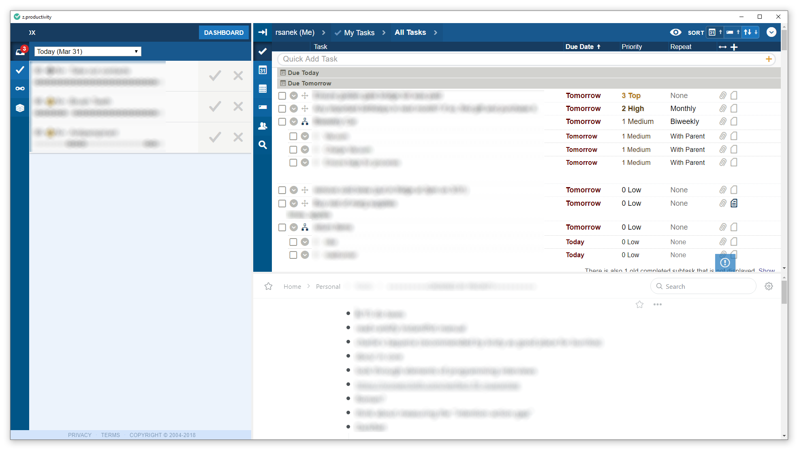

# z.productivity

A PyQt-based split view of Toodledo Habits, Toodledo Tasks, and Workflowy items.

## Usage
 - Install Python 3.7+ (if on Windows, ensure you install the 64-bit version, since otherwise you [won't be able to get WebEngine modules](https://www.riverbankcomputing.com/software/pyqt/download5)).
 - `pip install PyQt5==5.11.3`
 - `python z.productivity.py`
 
There seem to be problems on Windows with PyQt 5.12, so here we instruct `pip` to use 5.11.3.
